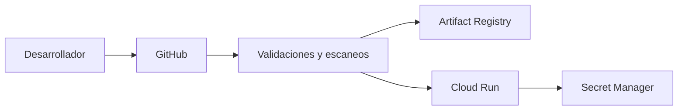

# Servicio de consulta de trámites

API para consultar el estado de un trámite. La plataforma se despliega en Cloud Run mediante GitHub Actions.



## Ejecución local

```bash
python3 -m venv .venv
source .venv/bin/activate
pip install -r requirements.txt
export API_KEY=clave-local-de-prueba
uvicorn app.main:app --reload
```

La API expone `GET /health` y `GET /tramites/{numero}`. La consulta requiere el encabezado `X-API-Key`.

## Despliegue

El proyecto GCP, su facturación, las APIs y el bucket de estado remoto se preparan antes de Terraform. La configuración usa el bucket `prueba-tecnica-devops-1bd563-tfstate`.

```bash
cd infra
export TF_VAR_api_key='clave-temporal'
tofu init
tofu apply
```

GitHub Actions necesita estas variables del repositorio:

- `GCP_PROJECT_ID`
- `GCP_REGION`
- `WORKLOAD_IDENTITY_PROVIDER`
- `DEPLOYER_SERVICE_ACCOUNT`
- `RUNTIME_SERVICE_ACCOUNT`

Los cambios entran por pull request. El workflow verifica la aplicación, ejecuta Bandit, Gitleaks y Trivy, y solo despliega desde `main` si todos pasan. La imagen se publica con el SHA del commit.

## Decisiones

- Elegí Cloud Run porque el servicio tiene tráfico variable y no necesita la operación de un clúster. Descarté GKE para esta prueba por su costo y administracion.
- Elegí Workload Identity Federation para evitar llaves JSON. Descarté una credencial descargable por el riesgo de filtrarla.
- Elegí una API pequeña en memoria porque la evaluación se centra en la plataforma. Descarté agregar una base de datos real en esta entrega.

## Pendiente

- Sustituir los datos en memoria por persistencia.
- Separar ambientes y parametrizar completamente Terraform.
- Ampliar observabilidad, alertas y pruebas automatizadas.

## Destrucción

```bash
cd infra
tofu destroy
```

Después se eliminan manualmente el bucket de estado y el proyecto GCP.